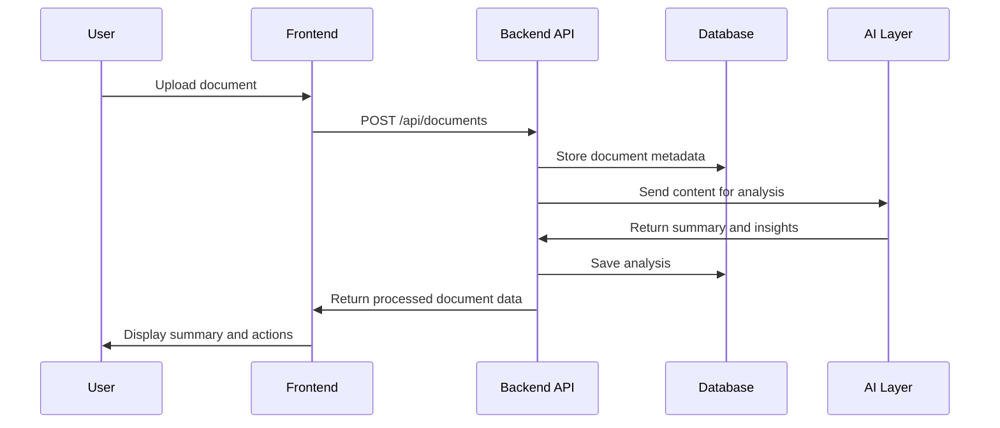

# API Documentation

## Overview

The backend exposes a modular REST API under the `/api` prefix. Each module represents a major product area of AI Workspace.

## Base URL

```text
http://localhost:5000/api
```

## API Module Diagram

```mermaid
flowchart TD
    API[/api]
    API --> Health[/health]
    API --> Auth[/auth]
    API --> Documents[/documents]
    API --> Meetings[/meetings]
    API --> Emails[/emails]
    API --> Tasks[/tasks]
    API --> Insights[/insights]
    API --> Activity[/activity]
    API --> AI[/ai]
    API --> Dashboard[/dashboard]
    API --> Settings[/settings]
```

## Diagram Explanation

This diagram shows the backend API divided into modules. Each module handles a separate feature area, which keeps the backend clean and maintainable.

## Endpoints

| Module | Base Path | Purpose |
| --- | --- | --- |
| Health | `/api/health` | Check whether backend is running |
| Auth | `/api/auth` | Authentication and user identity |
| Documents | `/api/documents` | Document upload, listing, analysis, and Q&A |
| Meetings | `/api/meetings` | Meeting records, transcripts, summaries, and action items |
| Emails | `/api/emails` | Email threads and AI-generated drafts |
| Tasks | `/api/tasks` | Task CRUD, assignment, status, and due dates |
| Insights | `/api/insights` | AI-generated workspace recommendations |
| Activity | `/api/activity` | Workspace event history |
| AI | `/api/ai` | AI assistant/generation features |
| Dashboard | `/api/dashboard` | Dashboard metrics and workspace overview |
| Settings | `/api/settings` | User and workspace preferences |

## Example API Flow



## Sequence Diagram Explanation

This sequence shows a future document-analysis flow. The user uploads a document through the frontend. The backend saves it, sends content to the AI layer, stores the AI output, and returns the result to the frontend.

## Sample Health Response

```json
{
  "status": "ok"
}
```

## Viva Explanation

The API is modular. All endpoints are grouped under `/api`. Each module maps to one product feature, such as documents, meetings, emails, tasks, or insights. This makes the backend easier to extend and test.
