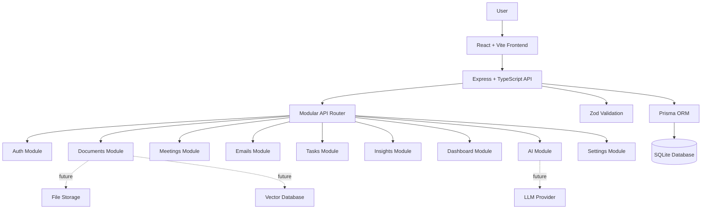

# System Architecture

## Overview

AI Workspace follows a modular full-stack architecture. The frontend provides the user interface, the backend exposes REST APIs, Prisma handles database access, and the database stores workspace data such as documents, meetings, emails, tasks, insights, and activity events.

## Architecture Diagram

## Diagram Explanation

This diagram shows how a user interacts with the React frontend. The frontend sends requests to the Express backend under `/api`. The backend separates features into modules such as documents, meetings, emails, tasks, AI, and dashboard. Prisma connects the backend to the database. Future AI features can connect to an LLM provider, file storage, and vector database.

## Layers

| Layer | Responsibility |
| --- | --- |
| Frontend | Displays pages, forms, dashboards, and AI workspace flows |
| Backend API | Handles HTTP requests and routes them to modules |
| Validation | Checks request data before processing |
| Prisma ORM | Provides database access through typed models |
| Database | Stores users, workspaces, documents, meetings, emails, tasks, insights, and activity |
| AI Layer | Future layer for summaries, Q&A, drafts, insights, and task extraction |

## Viva Explanation

AI Workspace uses a three-layer architecture: frontend, backend, and database. The frontend is built with React and Vite. The backend is built with Express and TypeScript. Prisma is used as an ORM to communicate with SQLite in development. The design is modular, so each feature has a separate route group, making the project easier to maintain and extend.
