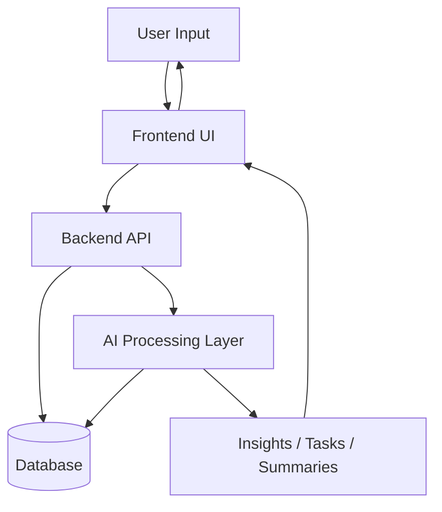

# Data Flow Diagram

## Overview

The data flow diagram shows how data moves through the system from user input to AI processing and final output.

## Data Flow Diagram

## Diagram Explanation

The user sends input through the frontend. The frontend sends requests to the backend API. The backend stores and retrieves data from the database. For AI-related features, the backend sends data to the AI layer, which processes it and returns results such as summaries, insights, or tasks.

## AI Workflow Example

1. User uploads a document.
2. Backend stores the document.
3. AI processes document into chunks and summary.
4. AI generates insights.
5. Insights are stored in the database.
6. Frontend displays insights and tasks.

## Viva Explanation

The data flow starts from the user and moves through the frontend to the backend. The backend interacts with the database and AI processing layer. The AI layer generates outputs like summaries and insights, which are sent back to the user interface.
