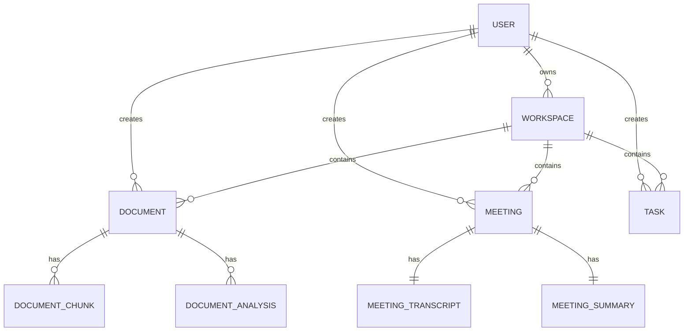

# Database Design

## Overview

The database is designed using Prisma ORM and stores all workspace-related data. It supports users, workspaces, documents, meetings, emails, tasks, insights, and activity logs.

## ER Diagram

## Diagram Explanation

This diagram shows relationships between entities. A user can own workspaces and create documents, meetings, and tasks. A workspace contains multiple documents, meetings, and tasks. Documents are split into chunks and analyses for AI processing. Meetings contain transcripts and summaries.

## Key Entities

| Entity | Purpose |
| --- | --- |
| User | Stores user identity and authentication |
| Workspace | Groups all data for a user or team |
| Document | Stores uploaded files |
| DocumentChunk | Stores split parts of documents for AI processing |
| DocumentAnalysis | Stores summaries and extracted insights |
| Meeting | Stores meeting information |
| MeetingTranscript | Stores raw meeting text |
| MeetingSummary | Stores summarized meeting output |
| Task | Stores action items |
| Insight | Stores AI-generated suggestions |
| ActivityEvent | Stores activity logs |

## Viva Explanation

The database is relational and designed using Prisma. Each workspace acts as a container for documents, meetings, tasks, and insights. Documents and meetings are processed into structured outputs such as summaries and chunks, which enables AI features like search and question answering.
