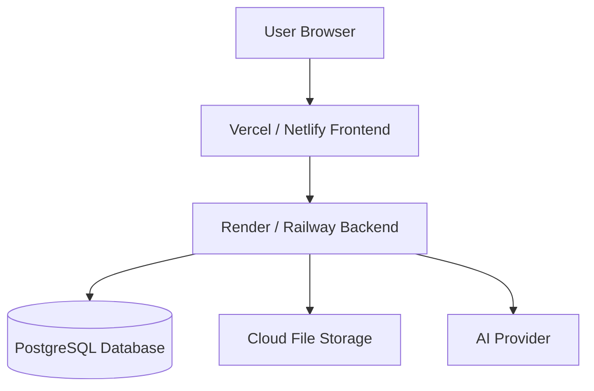

# Deployment

## Overview

Deployment describes how the AI Workspace application can be hosted for real users. The project has a separate frontend and backend, so both parts can be deployed independently.

## Local Deployment

### Backend

```bash
cd backend
npm install
cp env.example .env
npx prisma generate
npx prisma migrate dev
npm run dev
```

### Frontend

```bash
cd frontend
npm install
cp env.example .env
npm run dev
```

## Production Deployment Diagram



## Diagram Explanation

In production, the frontend can be deployed to Vercel or Netlify. The backend can be deployed to Render, Railway, or similar services. SQLite should be replaced with PostgreSQL. Uploaded files should be stored in cloud storage. AI features can connect to an external AI provider.

## Recommended Production Setup

| Component | Recommendation |
| --- | --- |
| Frontend | Vercel or Netlify |
| Backend | Render, Railway, Fly.io, or AWS |
| Database | PostgreSQL |
| File Storage | S3, Cloudinary, Supabase Storage, or similar |
| Secrets | Platform environment variables |
| AI Provider | OpenAI, Azure OpenAI, or similar |

## Viva Explanation

For local development, the project runs frontend and backend separately. For production, the frontend can be hosted on Vercel, the backend on Render or Railway, and the database should be upgraded from SQLite to PostgreSQL.
