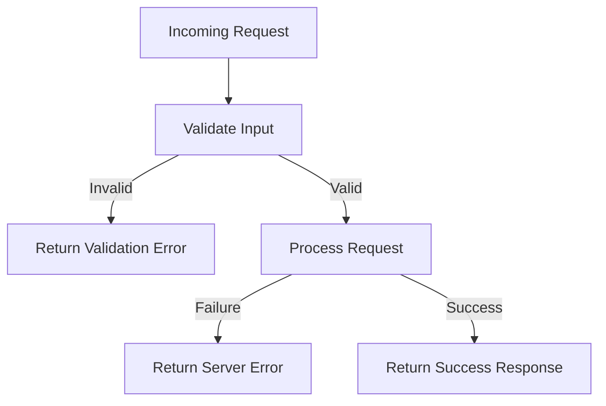

# Error Handling

## Overview

The backend uses centralized error handling to ensure consistent API responses. Validation errors, server errors, and missing resources are handled in a standard format.

## Error Flow



## Diagram Explanation

All requests are validated first. If validation fails, an error is returned immediately. If validation passes, the request is processed. If something fails internally, a server error is returned. Otherwise, a success response is sent.

## Common Error Types

| Status Code | Meaning |
| --- | --- |
| 400 | Bad request / validation error |
| 401 | Unauthorized |
| 403 | Forbidden |
| 404 | Resource not found |
| 500 | Internal server error |

## Example Error Response

```json
{
  "error": "Validation failed",
  "details": []
}
```

## Viva Explanation

Error handling ensures that all API responses follow a consistent format. Validation errors are handled before processing, and server errors are caught using middleware.
