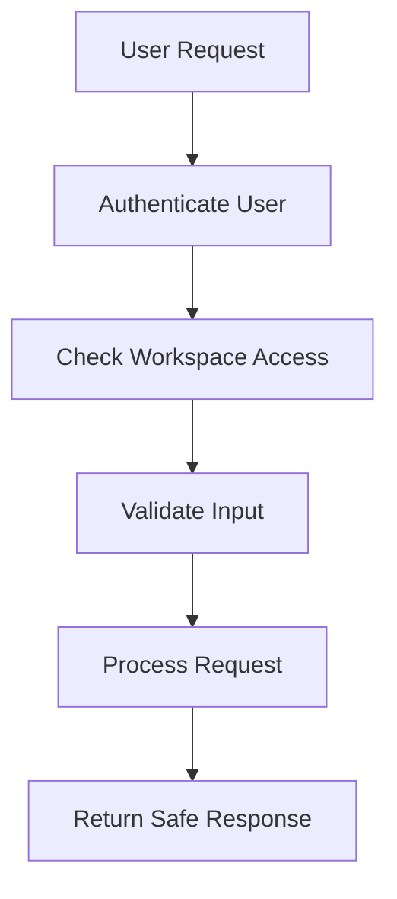

# Security

## Overview

Security is important because AI Workspace stores user data, workspace activity, documents, meeting content, email drafts, and tasks. The system must protect user information and prevent unauthorized access.

## Security Areas

| Area | Requirement |
| --- | --- |
| Authentication | Users should be verified before accessing private workspace data |
| Passwords | Passwords should be hashed and never stored in plain text |
| Environment Variables | Secrets should be stored in `.env` files and never committed |
| CORS | Production should restrict allowed frontend origins |
| Validation | Inputs should be validated using schemas such as Zod |
| Workspace Isolation | Users should only access data from their own workspace |
| File Uploads | File type and size should be validated |
| AI Safety | Prompts and uploaded content should be handled carefully to reduce prompt injection risk |
| Error Handling | Production errors should not expose stack traces or internal secrets |

## Security Flow

## Diagram Explanation

Every secure request should first verify the user. After authentication, the system checks whether the user belongs to the requested workspace. Then input is validated before the request is processed.

## AI-Specific Security

AI features introduce special security concerns. Documents, meeting transcripts, and emails may contain sensitive information. The system should avoid sending unnecessary private data to AI providers and should sanitize user-provided prompts when possible.

## Viva Explanation

Security in this project focuses on authentication, workspace-level access control, input validation, safe environment variables, and careful handling of AI data. Since the project may process private documents and meetings, data protection is a major concern.
