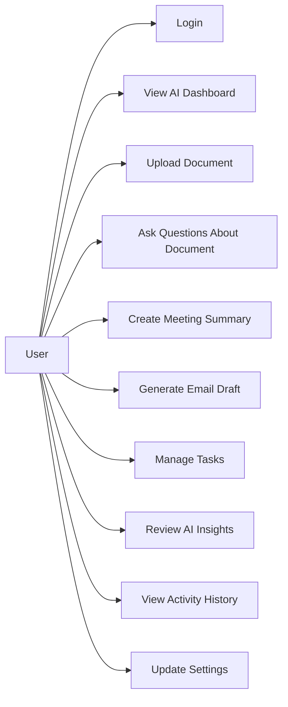

# Use Cases

## Overview

AI Workspace is designed for users who want to manage documents, meetings, emails, tasks, and AI insights from a single workspace.

## Main Actor

| Actor | Description |
| --- | --- |
| User | A person who uses the workspace to organize and automate productivity workflows |

## Use Case Diagram

## Diagram Explanation

This diagram shows what the user can do inside AI Workspace. The user can access the dashboard, upload documents, summarize meetings, draft emails, manage tasks, review insights, and view activity history.

## Key Use Cases

### UC-01: View AI Dashboard
The user opens the dashboard to see workspace metrics, AI insights, recent activity, and pending tasks.

### UC-02: Upload Document
The user uploads a document. The system stores the document and can later process it for summary, chunks, and Q&A.

### UC-03: Ask Questions About Document
The user asks a question about an uploaded document. The AI layer searches relevant document chunks and generates an answer.

### UC-04: Generate Meeting Summary
The user adds meeting information or transcript text. The system produces a summary, decisions, and action items.

### UC-05: Generate Email Draft
The user provides email context, recipient, subject, and tone. The AI assistant generates a professional draft.

### UC-06: Manage Tasks
The user creates, updates, assigns, and completes tasks. Some tasks can also be created from meetings, documents, or AI insights.

### UC-07: Review AI Insights
The user reviews proactive suggestions such as overdue tasks, follow-up reminders, or documents needing attention.

## Viva Explanation

The main actor of the system is the user. The user can interact with all modules from the dashboard. The most important AI use cases are document question answering, meeting summarization, email draft generation, task extraction, and AI insights.
