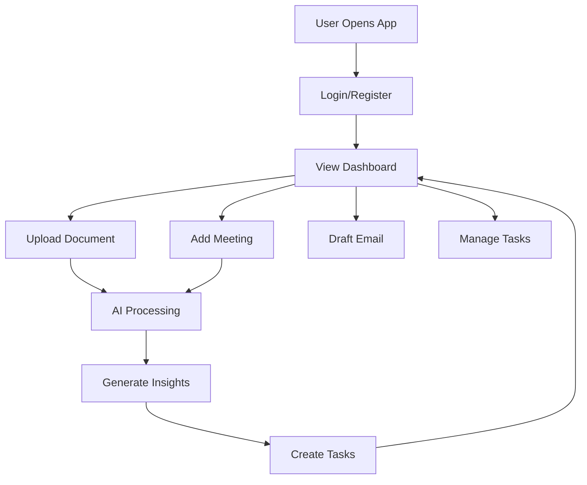

# User Flow

## Overview

User flow describes how a user interacts with the system step by step from login to completing tasks using AI assistance.

## User Flow Diagram

## Diagram Explanation

The user starts by logging in and accessing the dashboard. From the dashboard, the user can upload documents, create meetings, draft emails, or manage tasks. Documents and meetings are processed by AI, which generates insights and can automatically create tasks.

## Step-by-Step Flow

1. User logs into the system.
2. User views dashboard insights and metrics.
3. User uploads document or meeting data.
4. System processes data using AI.
5. AI generates summaries and insights.
6. System suggests or creates tasks.
7. User reviews and updates tasks.

## Viva Explanation

User flow shows how the system is used in practice. The user interacts with the dashboard and modules, while AI processes data in the background and generates insights, summaries, and tasks.
